# <p style="text-align: center;">Genetic Algorithm</p>

## Suggestion
&emsp;&emsp;Before you start this project.,some background knowledge you must need to know: First,you have to know what "Evalutionary Calculation" is. I strongly suggest you to have the class before starting. Second, some accelerating skills on hardware will be used in this design. For example, pipelining, caching and so on. Wish you have a good time for learning it~~

# Table of content
1. [Introduction](#i-introduction)
2. [Genetic-Algorithm](#ii-genetic-algorithm) 
3. [Problem-specification](#iii-problem-specification--objectives)
4. [Tips](#tips-for-you-to-implement-this-design-on-hardware)
5. [ACKNOWLEDGMENT](#acknowledgment)

# I. Introduction
&emsp;&emsp;Genetic Algorithm is based on the biological concept of Darwinian evolution. In nature, variations in genetic material (i.e. DNA) gives rise to small differences in physical expression, which affects an individual creature’s ability to mate and survive in a process called natural selection. This phenomenon is named such because the changes occur naturally through genetic operators called crossover (mating) and mutation, and generally the most well adapted creatures are able to find food, a mate, and evade prey.<br />
&emsp;&emsp;If we can find a way to map this concept of Darwinian evolution to an  algorithm, we can often get arbitrarily close to solving exponential time problems. We can see population diversity in the Darwinian model as a mechanism for exploring a high-dimensional state space, and use a fitness function to model how well equipped an individual is to survive in the environment and pass on its genes to the next generation. In order to solve problems in terms of Genetic Algorithm, chromosome, genetic operators, and a fitness function need to be defined
in relation to the problem. In the next section, we will explain how the concepts of Genetic Algorithm apply to our Minimal Energy Lattice Explorer, and our vision for the high-level design.

# II. Genetic Algorithm

## 1. Notion of Natural Selection
<p align="center">
  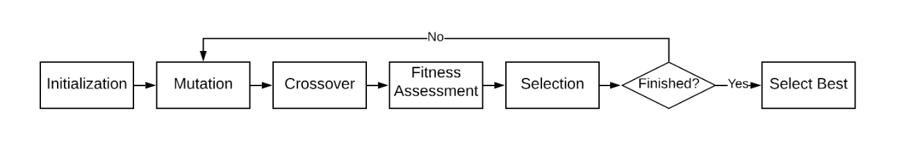
</p>

&emsp;&emsp;Genetic algorithms are useful for optimizations problems that have many parameters across a large search space, where traditional techniques may run into troubles. Implementing genetic optimization on hardware allows for highly parallelized operations, allowing us to
solve the problem faster than we’d otherwise be able to if we used software alone.

## 2. Initilization
<p align="center">
  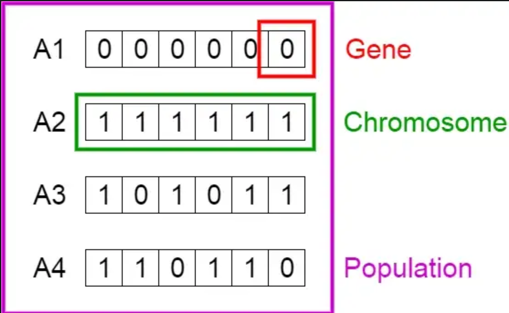
</p>
&emsp;&emsp;The process begins with a set of individuals which is called a Population. Each individual is a solution to the problem you want to solve.

&emsp;&emsp;An individual is characterized by a set of parameters (variables) known as Genes. Genes are joined into a string to form a Chromosome (solution).

&emsp;&emsp;In a genetic algorithm, the set of genes of an individual is represented using a string, in terms of an alphabet. Usually, binary values are used (string of 1s and 0s). We say that we encode the genes in a chromosome.

## 3. Mutation
<p align="center">
  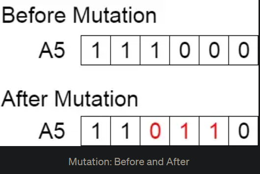
</p>
&emsp;&emsp;In certain new offspring formed, some of their genes can be subjected to a mutation with a low random probability. This implies that some of the bits in the bit string can be flipped.<br/>

## 4. CrossOver
<p align="center">
  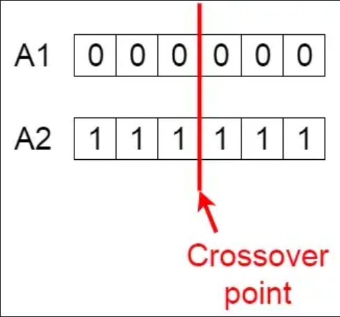
</p>
&emsp;&emsp;Crossover is the most significant phase in a genetic algorithm. For each pair of parents to be mated, a crossover point is chosen at random from within the genes.<br/>

## 5. Fitness Assessment
<p align="center">
  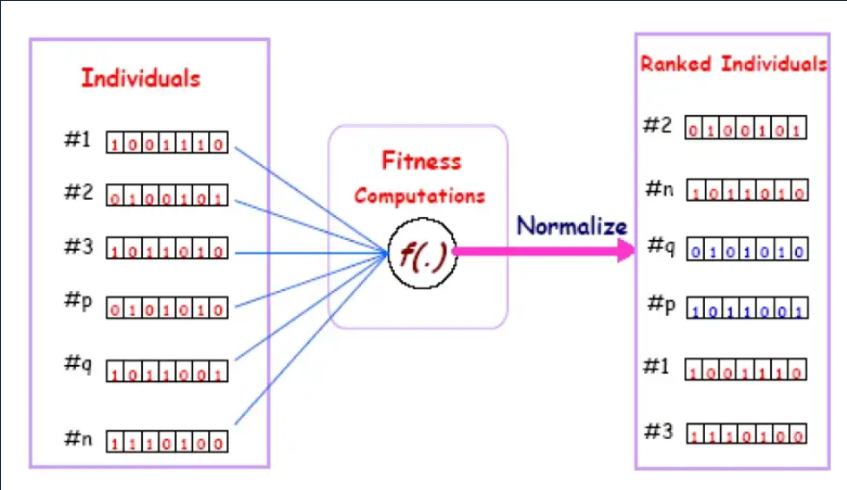
</p>
&emsp;&emsp;The fitness function determines how fit an individual is (the ability of an individual to compete with other individuals). It gives a fitness score to each individual. The probability that an individual will be selected for reproduction is based on its fitness score.<br/>

## 6. Selection
<p align="center">
  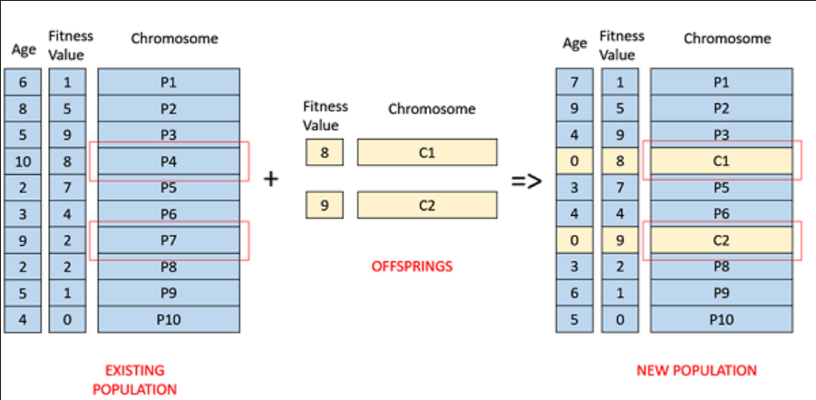
</p>
&emsp;&emsp;The idea of selection phase is to select the fittest individuals and let them pass their genes to the next generation.<br/>

&emsp;&emsp;Two pairs of individuals (parents) are selected based on their fitness scores. Individuals with high fitness have more chance to be selected for reproduction.<br/>

## 7. Best individual
&emsp;&emsp;The population has a fixed size. As new generations are formed, individuals with least fitness die, providing space for new offspring.<br/>

&emsp;&emsp;The sequence of phases is repeated to produce individuals in each new generation which are better than the previous generation. The Best Individual would be produced after running out of generation counts.<br/>

# III. Problem specification & Objectives
## 1. Combinatorial energy minimization
<p align="center">
  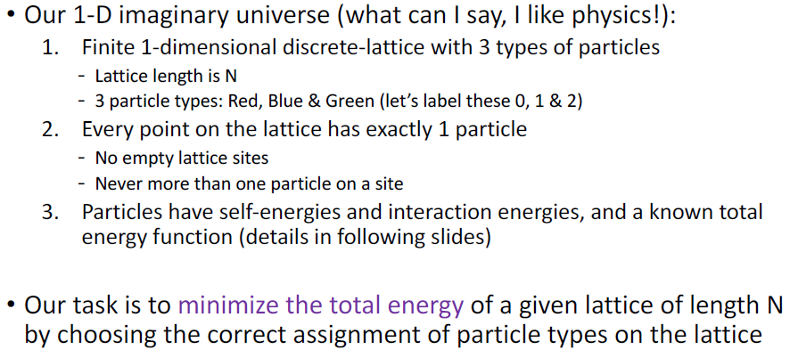
</p>

Our task is to minimize the total energy of a given lattice of length N
by choosing the correct assignment of particle types on the lattice

## 2. Lattice
<p align="center">
  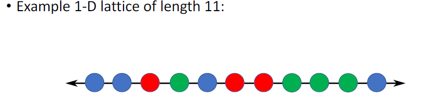
</p>

We will represent our lattice as a sequence of integer number,denoted L as lattice where L=[x_1,x_2,x_3,........] where x of i is an integer value corresponds to a certain particle type.

## 3. Self-Energy Vector
<p align="center">
  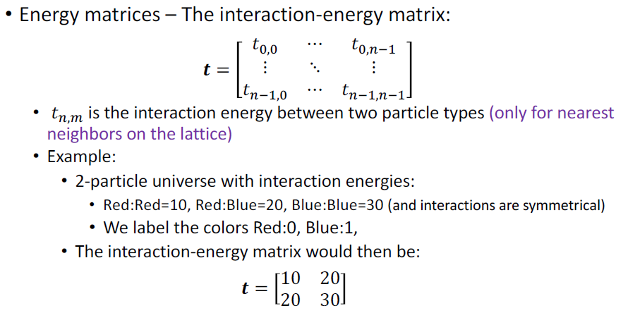
</p>

## 4. Interaction-Energy Matrix
<p align="center">
  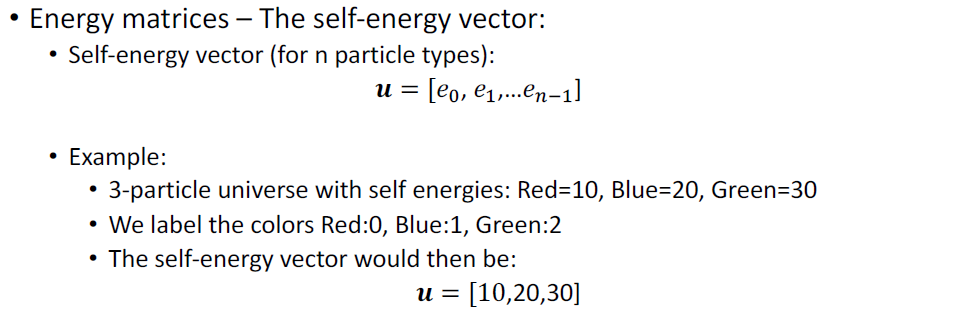
</p>


## 5. Fitness Function
<p align="center">
  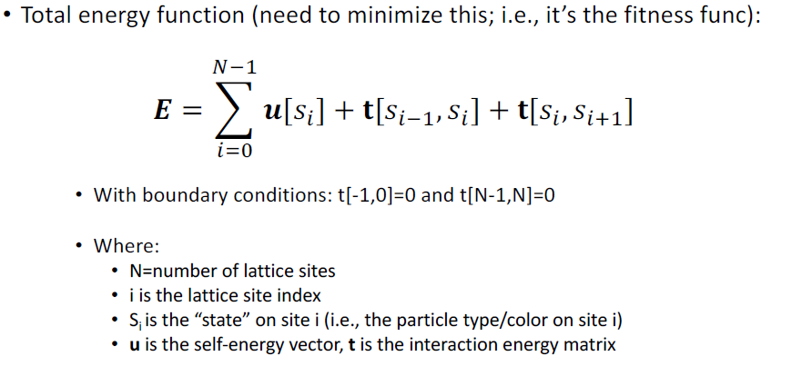
</p>
&emsp;&emsp;Goal is to find the lattice that contains the minimal Energy, this is the total Energy function used for calculation.
<br /><br />

# Tips for you to implement this design on hardware

1. Change into non-self_adaptive mutate<br />
2. Change all random variable into INT8<br />
3. Write individual into txt file<br />
4. Write Self-energy, interact-energy into txt file<br />
5. Try INT8 precision in python code before designing verilog code<br />
6. If you have done your verilog code, you can use the result of your testbench then putting it into python to check the answer. In my case, my Test.py file is used for testing Evaluate fitness verilog file.

## To Execute Our code
```
python ev3a.py --input ev3a_example.cfg
```

## ACKNOWLEDGMENT

&emsp;&emsp;We would like to ackowledge Professor Lindor for his mentorship and guidance throughout the research, design and implementation of this project. Without him, there would be no final implementation of this project, so as my EC Teammate. You can fellow their github. Here is the superconnection of their github. Thanks~ <br>
sicajc : https://github.com/sicajc <br>
Alchemist-Kang : https://github.com/Alchemist-Kang <br>

